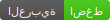

# unicode-shield

[](https://github.com/a-y-ibrahim/unicode-shield/actions/workflows/ci.yml)
[](LICENSE)
[](README.ar.md)

Detect and sanitize dangerous Unicode in user-supplied text, without breaking
real RTL text or emoji.

```bash
npm install unicode-shield
```

## Why

Some Unicode characters render as nothing, or make text display as something
other than what it actually is. A malicious username, chat message, or file
name can hide characters that:

- **Reorder how text displays** using bidi embedding/override characters, the
  exact mechanism behind the 2021 "Trojan Source" disclosure
  ([CVE-2021-42574](https://nvd.nist.gov/vuln/detail/CVE-2021-42574)). This is
  the class of bug fixed in
  [`bluesky-social/social-app#11066`](https://github.com/bluesky-social/social-app/pull/11066):
  a handle like `admin` could have invisible characters appended that make it
  copy and paste as something else entirely.
- **Pad or duplicate identity strings** using zero-width characters, so two
  visually identical usernames compare as different, or a blocked word slips
  past a filter.
- **Smuggle invisible instructions** using the deprecated Unicode Tags block
  (U+E0000-U+E007F) or the Variation Selectors Supplement (U+E0100-U+E01EF),
  both repurposed since 2024 as prompt-injection vectors: text encoded in
  these code points renders as nothing in every mainstream font, yet some
  LLMs still read and act on it.

## Why not an existing tool?

Source-code scanners for this character class already exist and are well
built, [`anti-trojan-source`](https://github.com/lirantal/anti-trojan-source)
in particular. They solve a different problem: catching these characters
*in your codebase*. `unicode-shield` is for the other side: catching them
*in data your users type*, at the moment you're about to store or render it.

Before building this, I looked for a runtime library that does that, across
npm, PyPI, crates.io, and pkg.go.dev, plus the open-source security tooling
major AI vendors ship. What turned up was either narrow (zero-width
stripping only, or confusables only), a source/CI scanner applied to the
wrong layer, or a handful of very recent projects that detect the right
characters but strip the legitimate ones too, breaking the exact RTL text
and emoji this library is careful not to touch. I didn't find one that
combines bidi-control detection, Unicode Tags-block detection, and
deliberate preservation of legitimate direction marks and script joiners.
That combination, correctness on the safe side included, is what this is
for.

## The other half of the problem

A tool like this is easy to get wrong in the opposite direction: stripping
*everything* unusual and quietly corrupting real text. Several of the
characters above have completely legitimate uses:

- `‎` (U+200E, LEFT-TO-RIGHT MARK) and `‏` (U+200F, RIGHT-TO-LEFT MARK) are
  single-character direction hints that correct Arabic, Hebrew, and other
  RTL text legitimately relies on.
- `‍` (U+200D, ZERO WIDTH JOINER) is how compound emoji like 👨‍👩‍👧‍👦 are
  built, and is required for correct text shaping in several scripts.
- `‌` (U+200C, ZERO WIDTH NON-JOINER) is required for correct word formation
  in Persian and several Indic scripts.

`unicode-shield` reports these too, because full visibility into what a
string contains is useful, but it never strips them by default. `sanitize()`
only removes the categories that have no legitimate use in a short piece of
user-supplied text.

## Usage

```ts
import {scan, sanitize, isSafe} from 'unicode-shield'

isSafe('admin')                    // true
isSafe('admin\u{202E}nimda')       // false, contains a bidi override

sanitize('admin\u{202E}nimda')     // 'adminnimda'

scan('price: 100\u{200E}\u{200F} ريال\u{061C}')
// {
//   safe: true,   // only informational bidi marks, nothing dangerous
//   threats: [
//     { category: 'bidi-mark', severity: 'informational', codePoint: 0x200e, ... },
//     { category: 'bidi-mark', severity: 'informational', codePoint: 0x200f, ... },
//     { category: 'bidi-mark', severity: 'informational', codePoint: 0x61c, ... },
//   ]
// }
```

### `scan(input: string): ScanResult`

Returns every threat found in `input`, dangerous and informational alike.
`safe` is `true` only when there are zero dangerous threats.

### `sanitize(input: string, options?: SanitizeOptions): string`

Returns `input` with dangerous characters removed. By default this strips
`bidi-embedding`, `bidi-isolate`, `invisible`, `tag`, `variation-selector`,
and `combining-marks` categories. Informational categories (`bidi-mark`,
`joiner`) are never touched unless you explicitly opt in:

```ts
sanitize(input, {categories: ['bidi-mark']})   // also strips LRM/RLM/ALM
sanitize(input, {replacement: '�'})       // substitute instead of delete
```

### `isSafe(input: string): boolean`

Shorthand for `scan(input).safe`.

## Threat categories

| Category         | Severity        | Examples                              | Stripped by default |
| ----------------- | --------------- | -------------------------------------- | -------------------- |
| `bidi-embedding`  | dangerous       | LRE, RLE, LRO, RLO, PDF                | yes |
| `bidi-isolate`    | dangerous       | LRI, RLI, FSI, PDI                     | yes |
| `invisible`       | dangerous       | zero-width space, word joiner, stray BOM | yes |
| `tag`             | dangerous       | U+E0000-U+E007F (deprecated Tags block) | yes |
| `variation-selector` | dangerous    | U+E0100-U+E01EF (Variation Selectors Supplement) | yes |
| `combining-marks` | dangerous       | stacked accents past a safe count ("Zalgo text") | yes |
| `bidi-mark`       | informational   | LRM, RLM, ALM                          | no |
| `joiner`          | informational   | ZWJ, ZWNJ                              | no |

Note on `variation-selector`: only the Supplement block is covered. The base
Variation Selectors block (U+FE00-U+FE0F, VS15/VS16) is never flagged, since
that's how ordinary text picks text-style vs emoji-style presentation for
thousands of common characters and emoji, and is extremely common in real
user text.

Note on `combining-marks`: every Unicode code point with General_Category
`Mn` (Nonspacing_Mark) counts as a combining mark, generated from Unicode's
own data rather than a hand-picked list. What makes one dangerous isn't the
character itself, real text in dozens of scripts depends on combining
marks, it's stacking more than 6 of them on a single base character, the
technique behind "Zalgo text" abuse (visual harassment, chat/username
corruption). Fully-voweled Arabic, Hebrew with niqqud and cantillation, and
similarly diacritic-heavy real text stay well under that count; `sanitize()`
caps a run at 6 marks instead of stripping all of them, so the base
character keeps a reasonable, real-looking amount of decoration.

## ESLint plugin

`scan`/`sanitize` only help if something actually calls them. The other way
this class of bug ships is a data path that never runs through either one:
`unicode-shield/eslint-plugin` catches that at review time instead of in
production, by checking whether identity-like text (a username, a handle, a
display name, a bio) reaches JSX, as a rendered child or through a
text-rendering attribute (`alt`, `title`, `placeholder`, `aria-label`,
`value`), unsanitized. This is a code-structure check of the kind described
in "Why not an existing tool?" above as source/CI scanning, not the runtime
text scanning `scan()` does, and unlike a general source scanner it's
specifically about whether *this library's* `sanitize()` sits in the path
before a risky-looking value renders.

```js
// eslint.config.js
import unicodeShield from 'unicode-shield/eslint-plugin'

export default [
  {
    plugins: {'unicode-shield': unicodeShield},
    rules: {'unicode-shield/require-sanitized-text': 'warn'},
  },
]
```

```jsx
<Text>{user.displayName}</Text>            // flagged, unsanitized child
                     // flagged, unsanitized attribute

<Text>{sanitize(user.displayName)}</Text>  // fine

const safeName = sanitize(user.displayName)
<Text>{safeName}</Text>                    // fine, traced back to the sanitize() call
```

### `require-sanitized-text`

Flags a JSX child expression, or the value of a text-rendering JSX
attribute, when it's a bare identifier or a property access with a
statically known name, dot or bracket notation alike (`{username}`,
`{user.bio}`, `{user["bio"]}`), whose name matches a configured list of
identity-like names, unless it's wrapped in `sanitize(...)` right there, or
traced back exactly one declaration to a local variable assigned from a
`sanitize(...)` call.

| Option | Default | |
| --- | --- | --- |
| `riskyNames` | `['username', 'handle', 'displayname', 'nickname', 'bio']` | Case-insensitive substring match against the identifier or property name. Replaces the default list rather than extending it. |
| `riskyAttributes` | `['alt', 'title', 'placeholder', 'aria-label', 'value']` | Exact, case-insensitive match against the JSX attribute name. Only these attributes are checked; anything else (`className`, `href`, `onClick`, ...) is never a text sink and is left alone. Replaces the default list rather than extending it. |
| `sanitizerNames` | `['sanitize']` | Function names, bare or as a property (e.g. `unicodeShield.sanitize`), recognized as sanitizing their argument. |
| `autoImport` | `{name: 'sanitize', source: 'unicode-shield'}` | What `--fix` wraps a violation in and imports it from, adding the import or merging into an existing one from the same source as needed. Set to `false` to report without offering a fix. |

Supports `--fix`: wraps the flagged value in a call (`user.bio` becomes
`sanitize(user.bio)`) and adds or reuses the import needed to make that call
valid, so running `eslint --fix` (or a save-time autofix in an editor) closes
most violations without hand-editing every call site. Point `autoImport` at
your own wrapper (`{name: 'cleanText', source: '~/utils/text'}`) if your
project doesn't sanitize by calling this package's `sanitize()` directly.

**What this rule deliberately doesn't do**, v1 scope rather than an
oversight:

- Checks JSX children and a fixed, curated list of text-rendering
  attributes, not arbitrary attributes. A prop that isn't in
  `riskyAttributes` (a custom component's own `label` prop, for example) is
  never checked; add it to `riskyAttributes` if it needs the same coverage.
- Understands only a bare identifier or one property access (a computed key
  like `user[someVariable]` can't be resolved statically and is skipped),
  and traces a variable back exactly one declaration. It's a naming
  heuristic, not real data-flow analysis: `{formatHandle(handle)}` isn't
  inspected, and reassignment (`let x = a; x = b`) isn't followed.
- Matches names by case-insensitive substring, so a name like
  `usernamePattern` can false-positive. Rename the variable, adjust
  `riskyNames`, or disable the line.
- Only recognizes a `sanitize()` call (or a name added to `sanitizerNames`)
  as proof of safety, not an `isSafe()` guard.
- The fix only wraps the flagged value and manages one import; it doesn't
  reformat the file, so run your own formatter afterward if the inserted
  import's style doesn't match the rest of the file.
- The fix only inserts an ES `import`, so it doesn't help in a CommonJS or
  other non-module file. Nothing downstream catches an unsafe fix on its
  own: ESLint's `--fix` writes whatever output it computes with no check
  that it still parses, so this rule validates every way a fix could
  otherwise corrupt a file, or silently sanitize nothing, itself, before
  ever offering one: `autoImport.name` must be a valid, non-reserved
  identifier (a typo like `sanitize-text`, or a name like `class`, reports
  without a fix instead); it must not already be bound to something
  unrelated in the file (a different import, a local variable or function
  under that name, an aliased import of a *different* export renamed to
  this local name, ...; reports without a fix instead of colliding with it
  or silently calling the wrong thing); and the file itself must actually
  support `import` syntax (reports without a fix in a script/CommonJS file
  instead of inserting one anyway).
- Correctly skips a TypeScript `import type {...}` (or a per-specifier
  `import {type x}`) when deciding whether `autoImport.name` is already
  imported or a merge target: those bind no runtime value, so relying on
  one would produce a fix that silently doesn't work; a real value import
  is added instead.

Requires `eslint >= 9`, declared as an optional peer dependency: the core
`scan`/`sanitize`/`isSafe` API has no dependency on ESLint at all, only this
subpath does.

## Confusables (homoglyph detection)

`scan`/`sanitize` cover characters that hide or reorder text. They don't
cover the other half of Unicode spoofing: characters that are simply drawn
to look like a different character, the class of bug behind lookalike
domains and usernames (an "apple" spelled with a Cyrillic а instead of a
Latin a). That's a separate, opt-in subpath, `unicode-shield/confusables`,
built on Unicode's own security data (UTS #39) rather than a hand-picked
list:

```ts
import {getSkeleton, areConfusable, detectMixedScript} from 'unicode-shield/confusables'

areConfusable('apple', 'аpple')   // true: the second "a" is Cyrillic
areConfusable('apple', 'orange')       // false

detectMixedScript('аpple')
// { mixed: true, scripts: ['Cyrillic', 'Latin'], suspicious: [{ char: 'а', codePoint: 0x430, index: 0, script: 'Cyrillic' }] }
```

### `getSkeleton(input: string): string`

The UTS #39 "skeleton" of a string: Unicode-normalize, replace every
character that has a documented confusable prototype with that prototype,
normalize again. Two strings are visually confusable exactly when their
skeletons match.

### `areConfusable(a: string, b: string): boolean`

Shorthand for `getSkeleton(a) === getSkeleton(b)`. The practical use case:
checking whether a newly chosen username or display name is visually
indistinguishable from one that already exists, the exact class of bug this
library's origin story is about.

### `detectMixedScript(input: string): MixedScriptResult`

Flags a string that mixes two or more scripts outside of Common and
Inherited (digits, punctuation, and combining marks are shared by every
script and never count as mixing on their own), the pattern behind
lookalike-domain spoofing. Reports the majority script plus which specific
characters don't belong to it. This is a practical heuristic, not an
implementation of UTS #39's full restriction-level algorithm.

**A real example of why "looks foreign" isn't the test.** Unicode's own
data lists Arabic ا (ALEF) as confusable with Latin `l`, both being a
single vertical stroke. `getSkeleton`/`areConfusable` will correctly say
so; `detectMixedScript('مرحبا')` will just as correctly say `mixed: false`,
because every character in that word is Arabic. Confusability and script
membership are independent questions, and mixing them up is exactly how a
detector ends up flagging ordinary RTL text.

**Why a separate subpath.** Unicode's confusables and script data cover
thousands of mappings; the generated data this ships is around 190&nbsp;KB.
Keeping it out of the core `unicode-shield` import means `scan`/`sanitize`
callers who don't need homoglyph detection pay nothing for it: `dist/index.js`
is unaffected by this feature's size.

## CLI

Everything above is a library API. `unicode-shield` also installs a
command line tool, for scanning files and directories without writing any
code, for example in a CI step that checks user-generated content dumps
or translation files.

```bash
npx unicode-shield scan ./content
npx unicode-shield scan file.txt --json
npx unicode-shield sanitize file.txt > clean.txt
npx unicode-shield sanitize ./content --write
npx unicode-shield compare "apple" "аpple"

# - means stdin, the standard grep/jq convention, for real Unix pipelines
cat file.txt | npx unicode-shield scan -
some-tool | npx unicode-shield sanitize - | another-tool
```

### `unicode-shield scan <path>`

Scans a file, every file in a directory recursively (skipping
`node_modules`, `.git`, and a handful of other build/dependency
directories, plus a denylist of binary file extensions), or stdin when
`path` is `-`, and reports every threat found via `scan()`. Exits `1` if
any dangerous threat was found, `0` if clean. `--json` prints structured
output instead of the human-readable default.

### `unicode-shield sanitize <path>`

Runs `sanitize()` over a file, a directory, or stdin when `path` is `-`.
Without `--write`, prints the sanitized content to stdout, so it can be
piped: `unicode-shield sanitize in.txt > out.txt`. `--write` modifies
file(s) in place instead: required for a directory (there's no single
stdout stream to usefully print multiple files to), and rejected for
stdin (there's no file to write back to). `--replacement <str>` and
`--categories <a,b,c>` map directly to `sanitize()`'s own options; an
unrecognized category name is rejected with the valid list rather than
silently doing nothing.

### `unicode-shield compare <a> <b>`

Runs `areConfusable()` on two strings directly, for checking whether a
newly chosen username or display name is visually indistinguishable from
an existing one. Exits `1` if they're confusable, `0` if not. `--json`
also includes both strings' skeletons.

Exit codes across all three commands: `0` clean, `1` a threat or
confusable pair was found, `2` a usage or runtime error (bad arguments, a
path that doesn't exist).

## What this is not

This is not a source-code scanner or a profanity filter. Confusable and
mixed-script detection above cover a specific, well-defined class of visual
spoofing; they are not a general "is this text suspicious" classifier, and
deliberately don't try to be.

## Changelog

See [CHANGELOG.md](CHANGELOG.md) for release history.

## License

MIT. The generated Unicode data behind `unicode-shield/confusables` is
covered by its own license instead, see [THIRD_PARTY_NOTICES.md](THIRD_PARTY_NOTICES.md).
